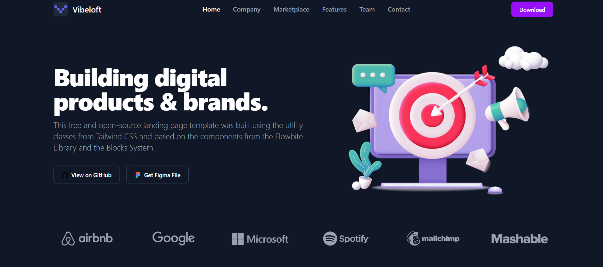
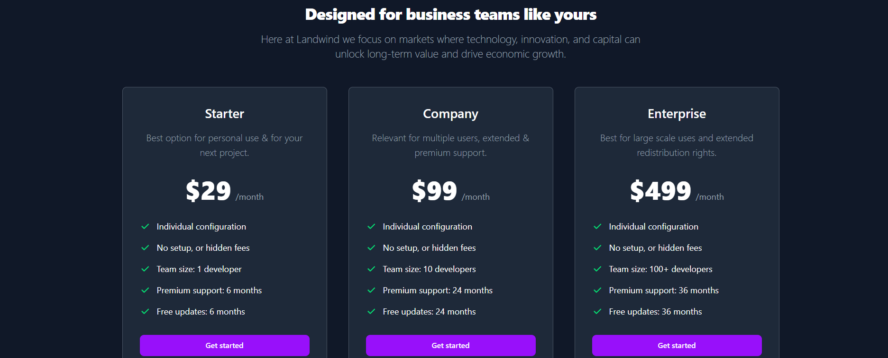

# 🚀 Viveloft – Digital Product Webpage

A modern, responsive **digital product landing page** built with **React** and **Tailwind CSS**. This single-page website is optimized for all devices and focuses on performance, accessibility, and clean design.

---

[## 🌐 Live Demo](https://vive-loft.vercel.app)

---

## 🛠️ Tech Stack

- **React 19**
- **Tailwind CSS 4**
- **Vite**
- **Custom Components**

---

## 📁 Folder Structure

```
vive-loft
├── src
│   ├── preview
│   │   ├── full preview.png
│   │   ├── hero.png
│   │   └── package.png
│   ├── components
│   │   ├── svg
│   │   │   ├── Airbnb.jsx
│   │   │   ├── Cart.jsx
│   │   │   ├── Check.jsx
│   │   │   ├── CheckSign.jsx
│   │   │   ├── Circle.jsx
│   │   │   ├── Countries.jsx
│   │   │   ├── DownArrow.jsx
│   │   │   ├── Facebook.jsx
│   │   │   ├── Figma.jsx
│   │   │   ├── Git.jsx
│   │   │   ├── Github.jsx
│   │   │   ├── Google.jsx
│   │   │   ├── Instagram.jsx
│   │   │   ├── Mailchimp.jsx
│   │   │   ├── Mashable.jsx
│   │   │   ├── Microsoft.jsx
│   │   │   ├── Quote.jsx
│   │   │   ├── RightArrow.jsx
│   │   │   ├── Spotify.jsx
│   │   │   ├── Twitter.jsx
│   │   │   ├── UpArrow.jsx
│   │   │   ├── UpTime.jsx
│   │   │   └── Users.jsx
│   │   ├── Button.jsx
│   │   ├── Faq.jsx
│   │   ├── Footer.jsx
│   │   ├── FooterCard.jsx
│   │   ├── Header.jsx
│   │   ├── HeaderItem.jsx
│   │   ├── Hero.jsx
│   │   ├── LogoLink.jsx
│   │   ├── Price.jsx
│   │   ├── PriceCard.jsx
│   │   ├── Quotes.jsx
│   │   ├── Tools.jsx
│   │   ├── ToolsCard.jsx
│   │   ├── Trail.jsx
│   │   ├── TrustBanner.jsx
│   │   └── TrustCard.jsx
│   ├── assets
│   │   ├── features
│   │   │   ├── feature-1.png
│   │   │   └── feature-2.png
│   │   ├── avatar
│   │   │   └── michael-gouch.png
│   │   ├── hero.png
│   │   └── logo.svg
│   ├── App.jsx
│   ├── index.css
│   └── main.jsx
├── public
│   └── logo.svg
├── .gitignore
├── eslint.config.js
├── index.html
├── package-lock.json
├── package.json
├── README.md
└── vite.config.js
```


---

## 📦 Dependencies

```json
"dependencies": {
  "@tailwindcss/vite": "^4.1.11",
  "react": "^19.1.0",
  "react-dom": "^19.1.0",
  "tailwindcss": "^4.1.11"
}
```


---

---

## 📸 Screenshots

### 🖼️ Hero Section


### 🖼️ Package


### 🖼️ Full Preview


---

## 👥 How to Clone, Setup & Run

### 📥 Clone the Repository

```bash
git clone https://github.com/devo-ab/viveloft.git
cd viveloft
```

### Install Dependencies
```
npm install
```

### Start Development Server
```
npm run dev
```
### Build for Production
```
npm run build
```
### Preview Production Build
```
npm run preview
```

# 👤 Author
# Avi Jit
## :mailbox: Reach me out
<p align="left">
<a href="https://linkedin.com/in/itsavijitb" target="blank"></a>
<a href="https://twitter.com/itsavijitb" target="blank"></a>
<a href="https://facebook.com/itsavijitb" target="blank"></a>
<a href="https://instagram.com/itsavijitb" target="blank"></a>
</p>